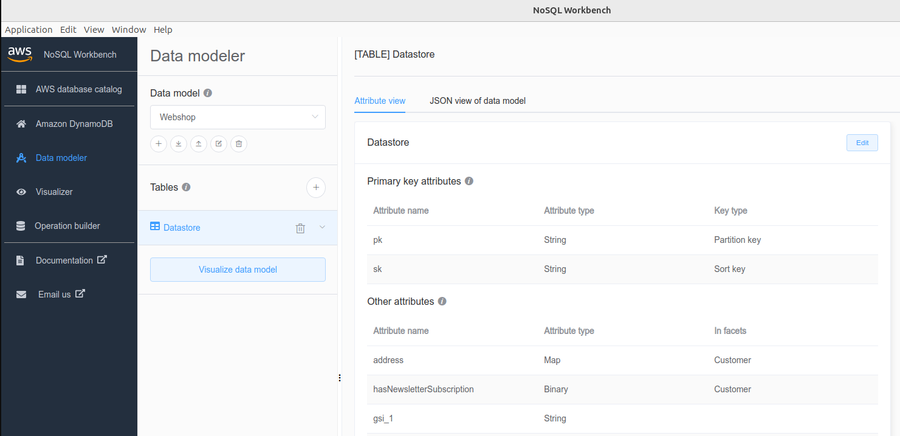

# 1) Design your dynamodb single table

Start by creating a new datamodel:

The guide assumes that you already collected your queries and your table structure.

The following example has the partition key "pk", sort key "sk", and one glbal secondary index "gsi_1".

Define all attributes and facets.

> In NoSQL Workbench, facets represent an application's different data access patterns for Amazon DynamoDB. Facets can help you visualize your data model when multiple data types are represented by a sort key. Facets give you a way to view a subset of the data in a table, without having to see records that don't meet the constraints of the facet. Facets are considered a visual data modeling tool, and don't exist as a usable construct in DynamoDB, as they are purely an aid to modeling of access patterns.

Once you are ready export your model as json.

